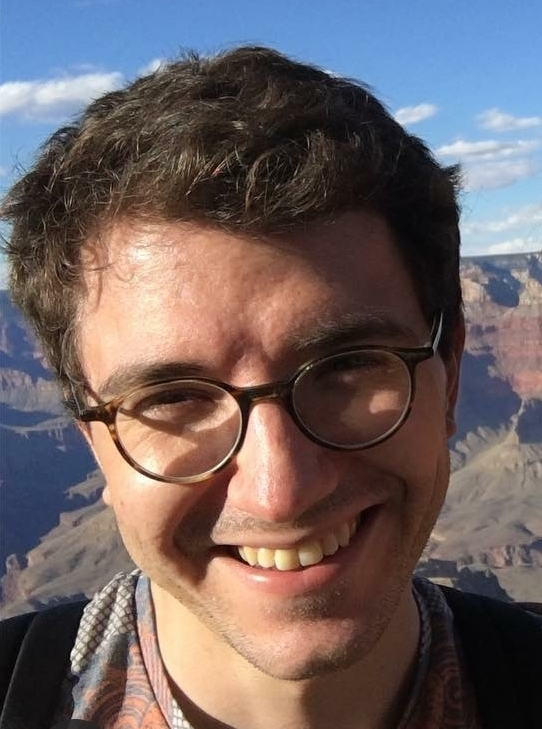

__Assistant Professor (RTPC) of Mathematics__ --- University of Southern California  

  

_I am on the job market this year. I only consider tenure-track or permanent contracts._  
  
  
In 2019--2021 I was a postdoc at USC Viterbi with [Meisam Razaviyayn](https://sites.usc.edu/razaviyayn/research/).   Previously, I was an ERCIM A. Bensoussan fellow at Inria Paris hosted by [Francis Bach](https://www.di.ens.fr/~fbach/).  
I graduated with a PhD in 2018. My advisors were [Anatoli Juditsky](https://ljk.imag.fr/membres/Anatoli.Iouditski/) and [Zaid Harchaoui](http://faculty.washington.edu/zaid/index.html). 
 
  
## Links ##

Here is my [__CV__](assets/dmitrii_ostrovskii_CV.pdf) and [__Google Scholar profile__](https://scholar.google.fr/citations?user=2IvZJ3cAAAAJ&hl=en). I also used to [__blog__](https://ostrodmit.github.io/blog/) about research, might pick it up again.