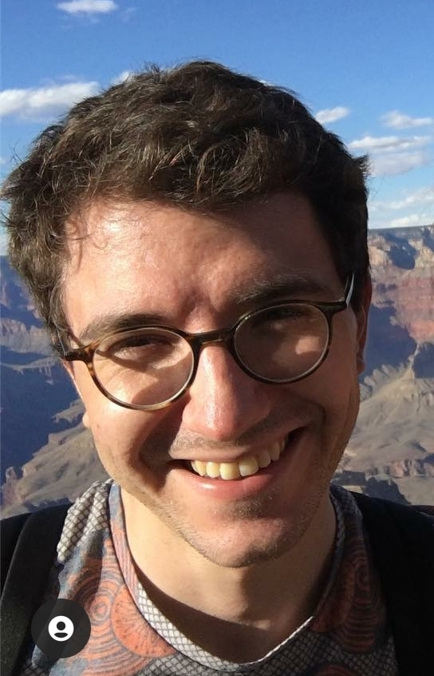

## About ##

I am a postdoc at the __University of Southern California__ with [__Meisam Razaviyayn__](https://sites.usc.edu/razaviyayn/research/).  
In 2018 and the first half of 2019, I was on a postdoc at __Inria Paris__ with [__Francis Bach__](https://www.di.ens.fr/~fbach/).  
I did PhD at the University of Grenoble under [__Anatoli Juditsky__](https://ljk.imag.fr/membres/Anatoli.Iouditski/) and [__Zaid Harchaoui__](http://faculty.washington.edu/zaid/index.html).
 
  
## Research ##

I work on various aspects of machine learning, statistics, optimization, and signal processing, such as: 
* statistical optimality and fast learning rates
* efficient algorithms and algorithmic lower bounds
* adaptation to unknown structure and parameters
* robust statistics

## Links ##

I keep updated my list of [__publications__](/papers) and my [__Google Scholar profile__](https://scholar.google.fr/citations?user=2IvZJ3cAAAAJ&hl=en). Feel free to check my [__CV__](assets/dmitrii_ostrovskii_CV.pdf) and [__research statement__](assets/research_statement.pdf).
I occasionally [__blog__](https://ostrodmit.github.io/blog/) about research.
