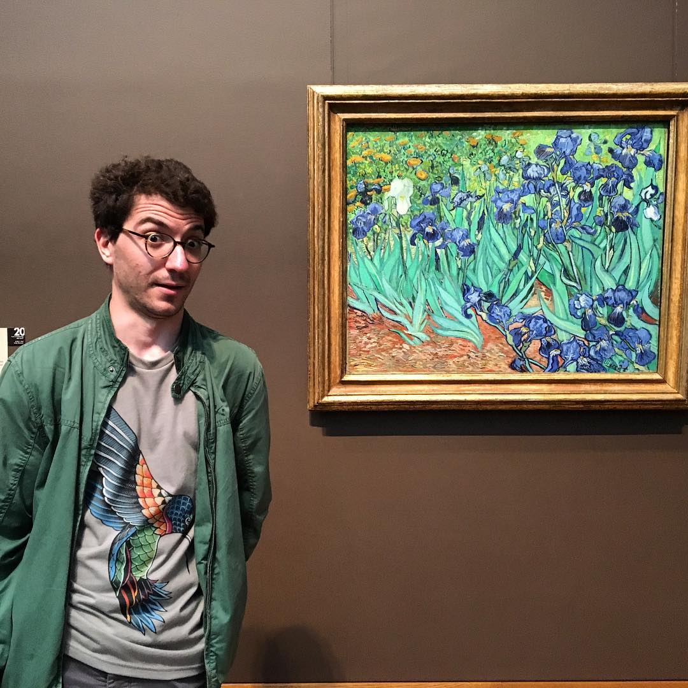

I am a postdoc at INRIA Paris
in the [group](https://www.di.ens.fr/sierra/) of [Francis Bach](https://www.di.ens.fr/~fbach/).
I defended my PhD thesis at the University of Grenoble Alpes, advised by [Anatoli Juditsky](https://ljk.imag.fr/membres/Anatoli.Iouditski/) and [Zaid Harchaoui](http://faculty.washington.edu/zaid/index.html).
 
  
## Research ##

I work on various theoretical aspects of machine learning, statistics, optimization, and signal processing, such as: 
* statistical optimality;
* algorithmic efficiency;
* adaptivity to the unknown structure and parameters;
* robustness.

You can find the list of my publications [here](???), as well as on my [Google Scholar profile](https://scholar.google.fr/citations?user=2IvZJ3cAAAAJ&hl=en).

I also maintain the research blog [__Look at the Corners__](https://ostrodmit.github.io/blog/), feel free to have a look.

[Here](https://ostrodmit.blog/) you can find some older posts on the topics I was interested in as a PhD student.