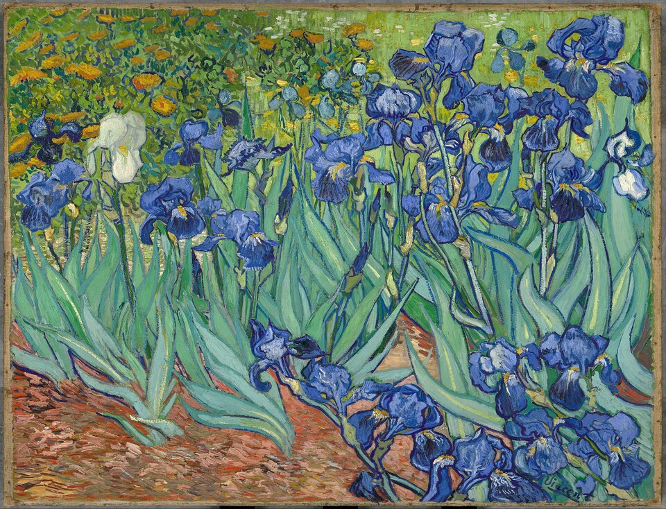

  

  

<h1>Research Interests</h1>

  

* __Statistics and learning theory:__ fast rates, robustness, adaptive estimation, nonparametric and high-dimensional estimation, testing, inverse problems, estimation and prediction with local shift-invariant structure, super-resolution.  
  
  
* __Optimization:__ first-order methods, minimax problems, non-Euclidean proximal geometry, acceleration, performance estimation, lower complexity bounds.  

<a href="https://scholar.google.fr/citations?user=2IvZJ3cAAAAJ&hl=en"><b>Google Scholar</b></a>&emsp;
<a href="assets/dmitrii_ostrovskii_CV.pdf"><b>CV</b></a>&emsp;
<a href="assets/research_statement.pdf"><b>Research Statement</b></a>

