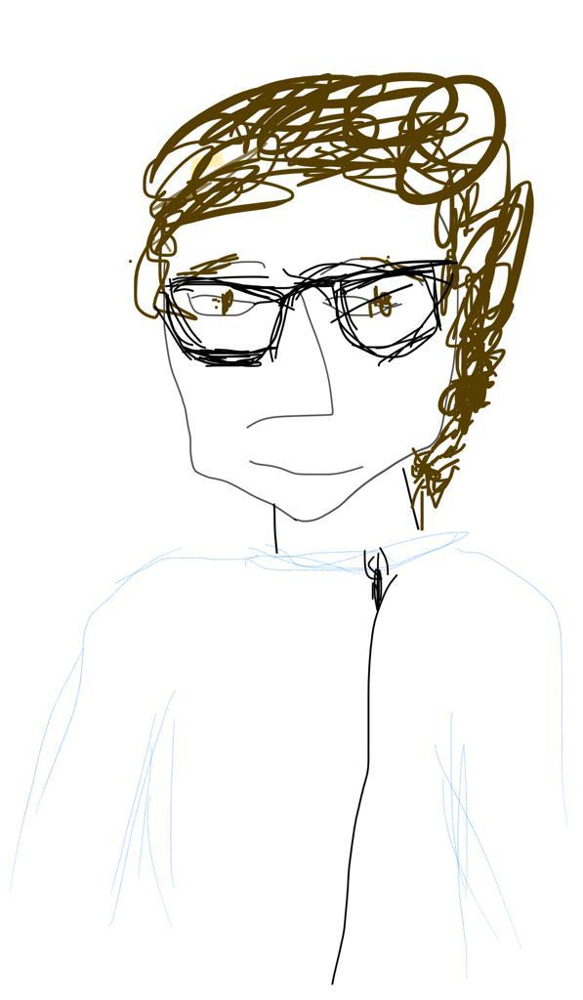

## Talks ##

10/2021: Johns Hopkins University, AMS seminar (invited talk)
__Nonconvex-Nonconcave Min-Max Optimization with a Small Maximization Domain__  
[[slides]](assets/slides/slides-small-domain.pdf)  

06/2021: Higher School of Economics, Moscow  
03/2021: Universitat Pompeu Fabra, Barcelona  
02/2021: University of Southern California, Los Angeles  
02/2021: EPFL, Lausanne  
01/2021: Weierstrass Institute, Berlin  
__Near-Optimal Procedures for Model Discrimination with Non-Disclosure Properties__  
[[slides]](assets/slides/slides-Newton-testing.pdf) 
[[video]](https://www.youtube.com/watch?v=s8TyXOuNlj4&ab_channel=DmitriiOstrovskii)  

05/2021: Ecole Polytechnique, Paris  
09/2019: University of Southern California, Los Angeles  
__On Fast Rates in Empirical Risk Minimization Beyond Least-Squares__  
[[slides]](assets/slides/USC-Epstein-seminar-handout.pdf)  

04/2021: Ecole Polytechnique, Paris  
06/2019: COLT 2019, Phoenix  
__Affine Invariant Covariance Estimation for Heavy-Tailed Distributions__  
[[slides]](/assets/slides/colt19-heavy-covariance.pdf) 
[[video]](https://www.youtube.com/watch?v=wNsb29RQK3o)  

04/2019: Toyota Technological Institute, Chicago  
__On Algorithmic Efficiency and Statistical Optimality in Empirical Risk Minimization__  
[[slides]](/assets/slides/TTIC-talk-2019.pdf)

09/2018: CWI-INRIA Workshop, Paris  
__Finite-Sample Analysis of M-Estimators Using Self-Concordance__  
[[slides]](/assets/slides/selfconc-CWI-workshop-slides.pdf)
 
 
07/2018: ICML 2018, Stockholm  
__Efficient First-order Algorithms for Adaptive Signal Denoising__  
[[slides]](assets/slides/algorec-icml18_back.pdf) 
[[video]](https://www.youtube.com/watch?v=ObTNWzgemOs&t=6360s)
 
 
04/2018: CWI, Amsterdam  
__Adaptive Signal Recovery by Convex Optimization__  
[[slides]](assets/slides/ostrovskii-sierra-handout.pdf)
 
 
02/2018: SIERRA seminar, Inria Paris  

11/2017: University of Grenoble Alpes  
__Adaptive Signal Denoising by Convex Optimization__  
[[slides]](assets/slides/ostrovskii-jdd-2017.pdf)
    
    
07/2017: Axel Munk's group seminar, IMS, Göttingen  
05/2017: Cédric Févotte's group seminar, IRIT Toulouse  
 05/2017: Mengdi Wang's group seminar, Princeton  
02/2017: Sham Kakade's group seminar, University of Washington, Seattle  
12/2016: NIPS 2016, Barcelona (poster)  
__Structure-Blind Signal Recovery__     
[[poster]](assets/posters/nips2016-poster.pdf)

11/2016: PGMO Days 2016, Paris  

08/2015: COLT 2015, Paris (spotlight)  
__Adaptive Recovery of Signals by Convex Optimization__  
[[slides]](assets/slides/colt2015-slides.pdf) 
[[poster]](assets/posters/colt2015-poster.pdf) 

04/2015: StatLearn 2015, Grenoble  

11/2013: 56th Annual MIPT Conference, Moscow  
__Concentration Inequality for the Exponential Weighting Method__ (in Russian)  
[[slides]](assets/slides/mipt2014-MSc-slides.pdf)

  

  

&copy; Victoria Marquez Feldman

  
